# Дипломный Проект по курсу DevOps

Задание для этого итогового дипломного проекта можно посмотреть тут:  https://github.com/olegbukatchuk/devops-diplom-yandexcloud

Возможно это покажется смелой новаторской идеей, но я решил записать небольшой ролик, который можно считать защитой дипломного проекта. В нём я рассказываю о ключевых моментах проекта, а также происходит процесс деплоя всей инфраструктуры и демонстрация работы полученных сервисов. Прошу принять во внимание, что я вовсе не видео-блогер и простить мне слова-паразиты и другие артефакты в речи. Возможно стоит смотреть на увеличенной скорости :).
https://youtu.be/bKPRvEf2qyw

## Краткое описание проекта

В соответствии с техническим заданием был создан IaaC проект, код которого состоит из двух основных частей: 
* Часть Terraform. Которая выполняет создание инфраструктуры (сетей и виртуальных машин) в облачном сервисе 
* Часть Ansible. Которая на уже созданых в инфраструктуре ВМ производит установку и настройку всего необходимого по ТЗ набора программного обеспечения.

После того, как выполнены все действия по деплою инфраструктуры и ПО, мы можем эксплуатировать полученную CI/CD систему для автоматического развертывания приложения при изменении кода.
В данном ТЗ приложением будем считать Web-Сайт, исходный код, которого хранится в репозитории `gitlab`, развёрнутом в ходе деплоя нашего кода инфраструктуры. 

Для реализации проекта я выбрал облачного провайдера AWS от Amazon. Выбор был связан с тем, что моя текущая и дальнейшая трудовая деятельность в ближайшей перспективе будет происходит в работе именно с этим облачным провайдером и этот дипломный проект станет не только тренировочной базой, но и частью моего портфолио. 

Для реализации проекта я взял уже имеющийся у меня купленный, но пока не использованный домен `citytours.ge`.

## Выполнение Проекта

### Подготовительная часть
#### DNS
Я принял решение использовать уже имеющийся у меня, оплаченный, домен `citytours.ge`, который зарегистрирован у регистратора в Грузии.
Так как в ходе развёртывания инфраструктуры мы должны будем управлять содержимым записи доменной зоны, я решил использовать DNS серверы сервисного провайдера CloudFlare, поскольку он поддерживает управление через API.
Поэтому я зарегистрировался у этого провайдера и создал там пока пустую доменную зону `citytours.ge`, а у Грузинского доменного регистратора сделал делегирование домена на DNS серверы CloudFlare.
В итоге перед деплоем нашей инфраструктуры в доменной зоне пока пусто, что можно проверить, например так:

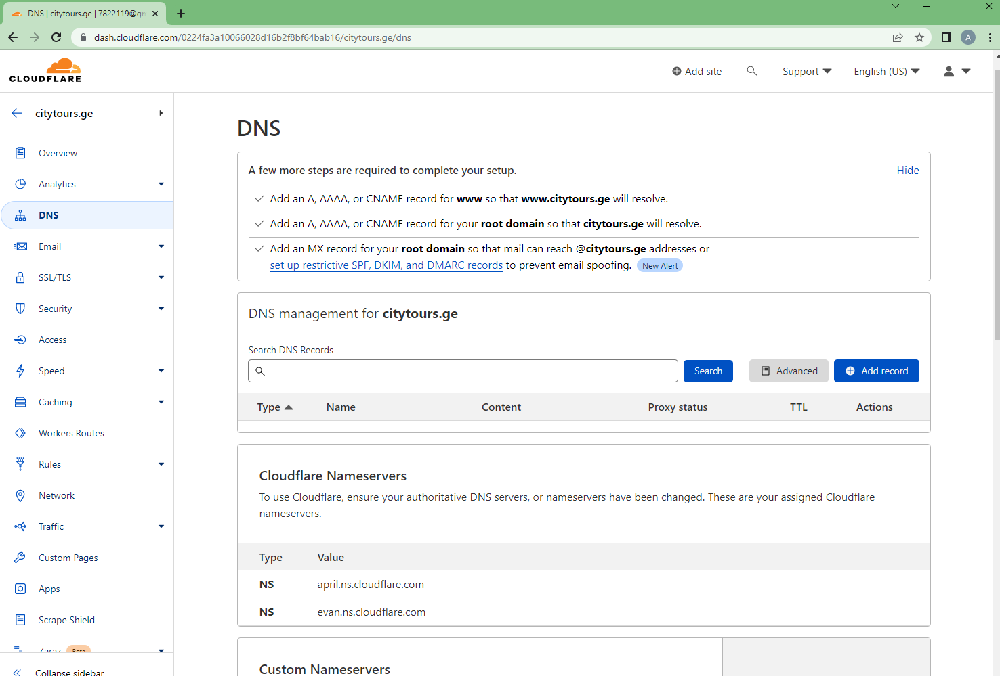

#### AWS
У меня имеется зарегистрированный аккаунт в AWS.
Для работ я выбрал регион `us-east-1`. Так как он был до этого не задействован и полностью свободен.
Проверяем, что имеется у нас в данном регионе:
Проверяем виртуальную сетевую инфраструктуру:
```shell
$ aws ec2 describe-vpcs --region us-east-1 --query "Vpcs[*].{CidrBlock:CidrBlock,IsDefault:IsDefault,VpcId:VpcId,Name:Tags[?Key=='Name']|[0].Value,State:State}" --output table

---------------------------------------------------------------------
|                           DescribeVpcs                            |
+----------------+------------+-------+------------+----------------+
|    CidrBlock   | IsDefault  | Name  |   State    |     VpcId      |
+----------------+------------+-------+------------+----------------+
|  172.31.0.0/16 |  True      |  None |  available |  vpc-bef033db  |
+----------------+------------+-------+------------+----------------+
```
Видим только дефолтную VPC. Мы её использовать не будем.
Команда просмотра имеющихся в регионе ВМ вообще возвращает пустой результат:
```shell
$ sudo aws ec2 --region us-east-1 describe-instances --query "Reservations[*].Instances[*].{PrivateIP:PrivateIpAddress,PublicIP:PublicIpAddress,Type:InstanceType,Name:Tags[?Key=='Name']|[0].Value,Status:State.Name}" --output table
$
```
Кроме того, перед началом работ я создал S3-backet для хранения состояния инфраструктуры (state-файла). 
```shell
$ aws s3 mb s3://diplom-akazand-backend-tfstate --region us-east-1
```
Пока бакет пуст:
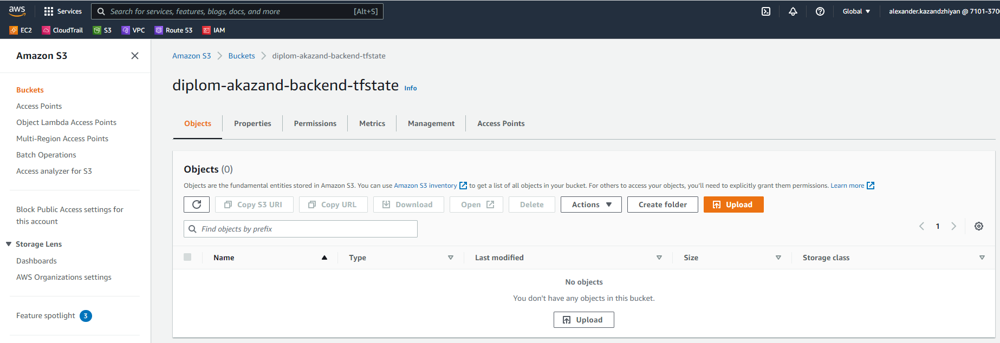

#### Terraform Backend и Workspases

В коде Terraform проекта создан файл описания `backend` для хранения стейтов: 
```shell
$ cat backend.tf
terraform {
  backend "s3" {
    bucket = "diplom-akazand-backend-tfstate"
    key = "main-infra/terraform.tfstate"
    region = "us-east-1"
    }
}
```
Выполним инициализацию terraform:
```shell
$ terraform init

Initializing the backend...

Successfully configured the backend "s3"! Terraform will automatically
use this backend unless the backend configuration changes.

Initializing provider plugins...
......
```

Теперь создадим Workspace, чтобы не пользоваться дефолтным.
Пока есть только дефолтное окружение:
```shell
$ terraform workspace list
* default
```
Создадим новое рабочее пространство (окружение):
```$ terraform workspace new stage
Created and switched to workspace "stage"!

You're now on a new, empty workspace. Workspaces isolate their state,
so if you run "terraform plan" Terraform will not see any existing state
for this configuration.

$ terraform workspace list
  default
* stage
```
Теперь мы можем увидеть, что оно не только создалось, но и вызвало инициализацию файла хранения состояния в нашем бакете:
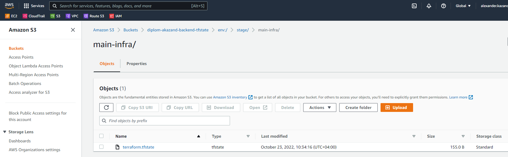

Все дальнейшие работы над проектом выполнялись в окружении `stage`.

### Состав проекта
Так как наш проект - это в чистом виде проект IaaC, то по сути это в чистом виде код. Код проекта состоит из двух частей:
* Код Terraform для создания инфраструктуры
* Код Ansible для установки и настройки программного обеспечения на всех ВМ инфраструктуры

Также нельзя не упомянуть, что у нас имеется 
* Код пайплайна для реализации CI/CD через наш создаваемый Gitlab
* Код приложения (по сути файлы сайта, которые будут храниться в репозитории Gitlab и выкладываться по CI/CD на веб-сервер)

Вот эти вторые коды в ходе демонстрации проекта мы будем вводить "руками" демонстрируя, как всё работает.

Мы видим две папки. По их именам понятно, что в них находится:
```
user1@work-vm-ubuntu:~/netology-diplom/devops-netology-diplom/diplom$ ll
total 22
drwxrwxr-x 4 user1 user1 4096 Oct 23 09:20 ./
drwxrwxr-x 4 user1 user1 4096 Oct 16 15:29 ../
drwxr-xr-x 4 user1 user1 4096 Oct 22 03:56 ansible/
drwxr-xr-x 3 user1 user1 4096 Oct 23 09:29 terraform/
```

Давайте познакомимся с составом папок проекта:
```
$ tree
.
├── ansible
│   ├── ansible.cfg
│   ├── provisioning.yaml
│   ├── variables.yaml
│   ├── inventory
│   ├── roles
│   │   ├── common
│   │   │   ├── files
│   │   │   └── tasks
│   │   │       └── main.yaml
│   │   ├── gitlab
│   │   │   └── tasks
│   │   │       └── main.yaml
│   │   ├── gitlabrunner
│   │   │   └── tasks
│   │   │       └── main.yaml
│   │   ├── monitoring
│   │   │   ├── files
│   │   │   │   ├── alert_rules.yml
│   │   │   │   ├── dashboards
│   │   │   │   │   ├── dashboard.json
│   │   │   │   │   └── dashboard.yml
│   │   │   │   └── datasources
│   │   │   │       └── datasource.yml
│   │   │   ├── tasks
│   │   │   │   └── main.yaml
│   │   │   └── templates
│   │   │       ├── alertmanager.yml.j2
│   │   │       ├── grafana.ini.j2
│   │   │       └── prometheus.yml.j2
│   │   ├── mysql-cluster-datanode
│   │   │   ├── files
│   │   │   │   └── ndbd.service
│   │   │   ├── tasks
│   │   │   │   └── main.yaml
│   │   │   └── templates
│   │   │       └── my.cnf
│   │   ├── mysql-cluster-management
│   │   │   ├── files
│   │   │   │   └── ndb_mgmd.service
│   │   │   ├── tasks
│   │   │   │   └── main.yaml
│   │   │   └── templates
│   │   │       └── config.ini
│   │   ├── mysql-cluster-sqlnode
│   │   │   ├── tasks
│   │   │   │   └── main.yaml
│   │   │   └── templates
│   │   │       └── my.cnf
│   │   ├── rproxy
│   │   │   ├── tasks
│   │   │   │   └── main.yaml
│   │   │   └── templates
│   │   │       └── nginx.conf.j2
│   │   └── webserver
│   │       └── tasks
│   │           └── main.yaml
└── terraform
    ├── backend.tf
    ├── dns_zone_manage.tf
    ├── inventory_full.tf
    ├── main.tf
    ├── make_hosts_file.tf
    ├── network.tf
    ├── node_db.tf
    ├── node_gitlabrunner.tf
    ├── node_gitlab.tf
    ├── node_monitoring.tf
    ├── node_web.tf
    ├── output.tf
    ├── rprpxy.tf
    ├── security-groups.tf
    ├── variables.tf
    └── versions.tf
```
Вот описание назначения всех файлов:

| **Часть** | **Файл**             | **Описание**                                                                                                                               |
|:----------|----------------------|:-------------------------------------------------------------------------------------------------------------------------------------------|
| Terraform | backend.tf           | Декларация места хранения файла состояний проекта                                                                                          |
| Terraform | variables.tf         | Переменные проекта, необходимые для Terraform-части проекта. Задание значений                                                              |
| Terraform | versions.tf          | Включение провайдеров в проект                                                                                                             |
| Terraform | main.tf              | Работа по выбору образа OS для ВМ проекта, Создание ssh-ключей                                                                             |
| Terraform | dns_zone_manage.tf   | Работа с DNS-записями на уровне провайдера услуг DNS                                                                                       |
| Terraform | network.tf           | Создание всей сетевой инфраструктуры в AWS, а также сетевых интерфейсов для всех ВМ                                                        |
| Terraform | security-groups.tf   | Создание Security Groups в AWS для разрешения прохождения сетевого траффика, нужного по проекту                                            |
| Terraform | rprpxy.tf            | Создание ВМ для Обратного Прокси-сервера.                                                                                                  |
| Terraform | node_web.tf          | Создание ВМ для Web-сервера                                                                                                                |
| Terraform | node_db.tf           | Создание двух ВМ для кластера Mysql                                                                                                        |
| Terraform | node_gitlab.tf       | Создание ВМ для сервера Gitlab                                                                                                             |
| Terraform | node_gitlabrunner.tf | Создание ВМ для cервера Gitlab runner                                                                                                      |
| Terraform | node_monitoring.tf   | Создание ВМ для сервера Мониторинга                                                                                                        |
| Terraform | make_hosts_file.tf   | По окончании развёртывания всей инфраструктуры ВМ, генерирует файл hosts для раскладывания на все ВМ через Ansible                         |
| Terraform | inventory_full.tf    | По окончании развёртывания всей инфраструктуры ВМ, генерирует inventory-файл для дальнейшей работы Ansible                                 |
| Terraform | output.tf            | Вывод получившихся ip-адресов ВМ rproxy для удобства работы с ним. Нужно скорее для отладки.                                               |
| --------- | -------------------- | ---------------------------------------------------------------------------------------------                                              |
| Ansible   | ansible.cfg          | Настройки ansible. По факту только отключение ненужного Gathering Facts для ускорения работы                                               |
| Ansible   | variables.yaml       | Переменные проекта, необходимые для Ansible-части проекта. Задание значений                                                                |
| Ansible   | provisioning.yaml    | Главный Плейбук проекта. Запускат развёртывание ПО на все ВМ в соответствии с назначением. Определяет, на какие ВМ, какие роли применяются |
| Ansible   | inventory (папка)    | Сюда Terraform положит файл inventory после создания всей инфраструктуры                                                                   |
| Ansible   | roles (папка)        | Содержит папки со всеми ролями. Описание каждой роли и её файлов см. ниже                                                                  |

### Описание работы систем развёртывания проекта. Часть Terraform

Как я уже сказал, было принято решение разворачивать всю инфраструктуру в AWS.
При этом не используются дефолтные VPC и прочие сущности. Мы всё создаём с нуля.

Код terraform-овской части можно посмотреть в папке terraform.
Я тут лишь прокомментирую некоторые моменты, заслуживающие внимания.
1. Все переменные, включая те, которые определяют параметры для AWS, заданы в файле с переменными `variables.tf`. Помимо очевидных вещей, там присутствует переменная `cloudflare_api_token` это api-token от учётной записи в сервисе CloudFlare, чей DNS сервис у нас использован для нашей доменной зоны.
2. На выходе работы terraform мы получаем не только готовую инфраструктуру AWS, включающую все сети и ВМ, но и:
   * файл: `inventory_full` для использования далее в части Ansible, содержащий в нужном формате список всех ВМ и параметров подключения к ним.
   * файл: `hosts`, содержащий список всех ВМ в формате `address имя`, который потом через Ansible распространяется на все ВМ для доступа всех ВМ друг к другу по именам, а не адресам. Благодаря этому, мы, в прнципе могли не задавать всем вм локальные адреса (в переменных) сами, а получить их от dhcp AWS и это бы нам не испортило работу.
   * файл с закрытым ssh-ключём, который генерируется нами в terraform. С помощью этого ключа мы можем подключаться к нашим ВМ по ssh без пароля (пользователя ubuntu). По сути этот ключ нужен нам на машине с которой мы запускаем ansible-playbook, а также этот ключ мы в ansible-роли `gitlabrunner` копируем на ВМ раннера, а затем внутри него прокидываем в docker-container, который на нём запускается для выкладываения файлов на веб-сервер. 
3. Я решил управлять доменной зоной нашего домена в сервисе CloudFlare через провайдер для terrafom, поэтому создан файл `dns_zone_manage.tf` в котором это запрограммировано. Я уже выше в Подготовительной части писал, что в Cloudflare зона записи по нашему домену создана пустой. Этот код заполняет её данными, создавая одну запись типа А (наш домен 2 уровня с адресом, полученным внешним интерфейсом rproxy) и несколько записей типа CNAME, указывающими на эту запись типа А.
После развёртывания проекта это выглядит так:
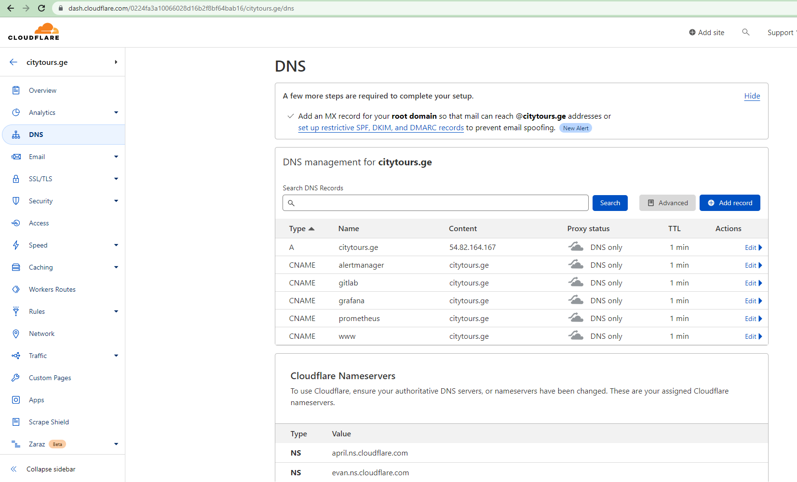

4. Как я уже писал, мы создаём всю сетевую инфраструктуру в AWS с нуля. Мы создаём VPC, Public Subnet, Private Subnet, Internet Gateway, Nat Gateway (к сожалению для него пришлось создавать Elastic-ip), и таблыцы маршрутов. Так как публичный адрес у нас получает только сервер rproxy. И только он имеет интерфейс в public subnet то для выхода в интернет всех остальных ВМ из Private сети используется Nat Gateway.
5. Также стоит упомянуть, что в коде terraform в файле `security-groups.tf` запрограммировано создание всех security group, которые по сути являются разрешающими правилами для сетевых фильтров внутри AWS. По-умолчанию для любой ВМ любой траффик заблокирован. Разрешается только то, что разрешено в рамках security groups.

Вывод на экран при показе плана работы и развёртывании кода Terraform представлен в файле `terraform.log`

Посмотрим, что у нас создалось в AWS после выполнения кода Terraform:

```shell
$ aws ec2 describe-vpcs --region us-east-1 --query "Vpcs[*].{CidrBlock:CidrBlock,IsDefault:IsDefault,VpcId:VpcId,Name:Tags[?Key=='Name']|[0].Value,State:State}" --output table

-------------------------------------------------------------------------------------
|                                   DescribeVpcs                                    |
+----------------+------------+-------------+------------+--------------------------+
|    CidrBlock   | IsDefault  |    Name     |   State    |          VpcId           |
+----------------+------------+-------------+------------+--------------------------+
|  192.168.0.0/16|  False     |  diplom-vpc |  available |  vpc-08e305c0a725f088c   |
|  172.31.0.0/16 |  True      |  None       |  available |  vpc-bef033db            |
+----------------+------------+-------------+------------+--------------------------+
```
Видим, что добавилась новая VPC, с параметрами указанными в файле переменных.
А также добавились подсети:
```shell
$ aws ec2 describe-subnets --region us-east-1 --query "Subnets[*].{SubnetId:SubnetId,VpcId:VpcId,CidrBlock:CidrBlock,AvailabilityZone:AvailabilityZone,MapPublicIpOnLaunch:MapPublicIpOnLaunch,Name:Tags[?Key=='Name']|[0].Value,State:State}" --filters "Name=tag:Name,Values=diplom*" --output table

------------------------------------------------------------------------------------------------------------------------------------------------------------
|                                                                      DescribeSubnets                                                                     |
+------------------+-----------------+----------------------+--------------------------+------------+----------------------------+-------------------------+
| AvailabilityZone |    CidrBlock    | MapPublicIpOnLaunch  |          Name            |   State    |         SubnetId           |          VpcId          |
+------------------+-----------------+----------------------+--------------------------+------------+----------------------------+-------------------------+
|  us-east-1a      |  192.168.1.0/24 |  False               |  diplom-private-Subnet-1 |  available |  subnet-07554f3856c0b646c  |  vpc-08e305c0a725f088c  |
|  us-east-1b      |  192.168.2.0/24 |  False               |  diplom-private-Subnet-2 |  available |  subnet-0fccc1d443a6a4d6d  |  vpc-08e305c0a725f088c  |
|  us-east-1a      |  192.168.0.0/24 |  True                |  diplom-public-Subnet    |  available |  subnet-0ddb06406cf8fc4b3  |  vpc-08e305c0a725f088c  |
+------------------+-----------------+----------------------+--------------------------+------------+----------------------------+-------------------------+
```
Мы запрграммировали в Terraform создание двух приватных сетей, так как было такое задание в ТЗ. Создать вторую подсеть в другой зоне.

Теперь посмотрим на ВМ:
```shell
$ aws ec2 --region us-east-1 describe-instances --query "Reservations[*].Instances[*].{PrivateIP:PrivateIpAddress,PublicIP:PublicIpAddress,Type:InstanceType,Name:Tags[?Key=='Name']|[0].Value,Status:State.Name}" --output table

-----------------------------------------------------------------------------------------
|                                   DescribeInstances                                   |
+------------------------------+--------------+----------------+----------+-------------+
|             Name             |  PrivateIP   |   PublicIP     | Status   |    Type     |
+------------------------------+--------------+----------------+----------+-------------+
|  diplom-vm-db_node_1         |  192.168.1.4 |  None          |  running |  t2.small   |
|  diplom-vm-rproxy            |  192.168.0.4 |  54.82.164.167 |  running |  t2.micro   |
|  diplom-vm-gitlabrunner_node |  192.168.1.8 |  None          |  running |  t3.micro   |
|  diplom-vm-web_node          |  192.168.1.6 |  None          |  running |  t2.micro   |
|  diplom-vm-gitlab_node       |  192.168.1.7 |  None          |  running |  t3.xlarge  |
|  diplom-vm-db_node_2         |  192.168.1.5 |  None          |  running |  t2.small   |
|  diplom-vm-monitoring_node   |  192.168.1.9 |  None          |  running |  t3.micro   |
+------------------------------+--------------+----------------+----------+-------------+
```
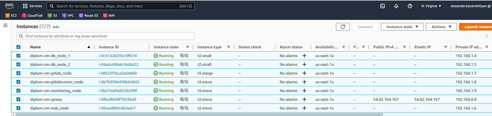


Создались и ожидаемые файлы:
```shell
user1@work-vm-ubuntu:~/netology-diplom/devops-netology-diplom/diplom$ ll ansible/roles/common/files
total 16
drwxrwxr-x 2 user1 user1 4096 Oct 21 22:54 ./
drwxrwxr-x 4 user1 user1 4096 Oct 19 09:23 ../
-rw-rw-r-- 1 user1 user1 3244 Oct 21 22:53 alexander-key-to-aws.pem
-rwxrwxr-x 1 user1 user1  319 Oct 21 22:54 hosts
```
```shell
user1@work-vm-ubuntu:~/netology-diplom/devops-netology-diplom/diplom$ cat ansible/roles/common/files/hosts
# This file /etc/hosts was created by Terraform and was installed via Ansible.

127.0.0.1 localhost

192.168.0.4 citytours.ge
192.168.1.6 app.citytours.ge
192.168.1.7 gitlab.citytours.ge
192.168.1.8 runner.citytours.ge

192.168.1.4 db01.citytours.ge

192.168.1.5 db02.citytours.ge

192.168.1.9 monitoring.citytours.ge
```
```shell
user1@work-vm-ubuntu:~/netology-diplom/devops-netology-diplom/diplom$ cat ansible/inventory/inventory_full
# Ansible inventory containing variable values from Terraform.
# Generated by Terraform.
[nodes:children]
rproxys
web_nodes
db_nodes
gitlab_nodes
gitlabrunner_nodes
monitoring_nodes

[rproxys]
rproxy ansible_host=184.73.0.112 ansible_ssh_private_key_file=~/.ssh/alexander-key-to-aws.pem ansible_ssh_common_args='-o StrictHostKeyChecking=no'

[web_nodes]
web_node ansible_host=192.168.1.6 ansible_ssh_private_key_file=~/.ssh/alexander-key-to-aws.pem ansible_ssh_common_args='-o StrictHostKeyChecking=no -o ProxyCommand="ssh -W %h:%p -q ubuntu@184.73.0.112 -i ~/.ssh/alexander-key-to-aws.pem -oStrictHostKeyChecking=accept-new"'

[db_nodes]

db01 ansible_host=192.168.1.4 ansible_ssh_private_key_file=~/.ssh/alexander-key-to-aws.pem ansible_ssh_common_args='-o StrictHostKeyChecking=no -o ProxyCommand="ssh -W %h:%p -q ubuntu@184.73.0.112 -i ~/.ssh/alexander-key-to-aws.pem -oStrictHostKeyChecking=accept-new"'

db02 ansible_host=192.168.1.5 ansible_ssh_private_key_file=~/.ssh/alexander-key-to-aws.pem ansible_ssh_common_args='-o StrictHostKeyChecking=no -o ProxyCommand="ssh -W %h:%p -q ubuntu@184.73.0.112 -i ~/.ssh/alexander-key-to-aws.pem -oStrictHostKeyChecking=accept-new"'


[gitlab_nodes]
gitlab_node ansible_host=192.168.1.7 ansible_ssh_private_key_file=~/.ssh/alexander-key-to-aws.pem ansible_ssh_common_args='-o StrictHostKeyChecking=no -o ProxyCommand="ssh -W %h:%p -q ubuntu@184.73.0.112 -i ~/.ssh/alexander-key-to-aws.pem -oStrictHostKeyChecking=accept-new"'

[gitlabrunner_nodes]
gitlabrunner_node ansible_host=192.168.1.8 ansible_ssh_private_key_file=~/.ssh/alexander-key-to-aws.pem ansible_ssh_common_args='-o StrictHostKeyChecking=no -o ProxyCommand="ssh -W %h:%p -q ubuntu@184.73.0.112 -i ~/.ssh/alexander-key-to-aws.pem -oStrictHostKeyChecking=accept-new"'

[monitoring_nodes]
monitoring_node ansible_host=192.168.1.9 ansible_ssh_private_key_file=~/.ssh/alexander-key-to-aws.pem ansible_ssh_common_args='-o StrictHostKeyChecking=no -o ProxyCommand="ssh -W %h:%p -q ubuntu@184.73.0.112 -i ~/.ssh/alexander-key-to-aws.pem -oStrictHostKeyChecking=accept-new"'
```
Запустим проверку доступности всех ВМ для Ansible, используя полученный inventory. Таким обрвзом проверяем и inventory файл и сами серверы:
```shell
$ ansible -i inventory_full -u ubuntu -m ping all
rproxy | SUCCESS => {
    "ansible_facts": {
        "discovered_interpreter_python": "/usr/bin/python3"
    },
    "changed": false,
    "ping": "pong"
}
db01 | SUCCESS => {
    "ansible_facts": {
        "discovered_interpreter_python": "/usr/bin/python3"
    },
    "changed": false,
    "ping": "pong"
}
web_node | SUCCESS => {
    "ansible_facts": {
        "discovered_interpreter_python": "/usr/bin/python3"
    },
    "changed": false,
    "ping": "pong"
}
gitlab_node | SUCCESS => {
    "ansible_facts": {
        "discovered_interpreter_python": "/usr/bin/python3"
    },
    "changed": false,
    "ping": "pong"
}
db02 | SUCCESS => {
    "ansible_facts": {
        "discovered_interpreter_python": "/usr/bin/python3"
    },
    "changed": false,
    "ping": "pong"
}
gitlabrunner_node | SUCCESS => {
    "ansible_facts": {
        "discovered_interpreter_python": "/usr/bin/python3"
    },
    "changed": false,
    "ping": "pong"
}
monitoring_node | SUCCESS => {
    "ansible_facts": {
        "discovered_interpreter_python": "/usr/bin/python3"
    },
    "changed": false,
    "ping": "pong"
}
```
Как мы видим все серверы доступны и готовы к прокатке Ansible Playbook.

### Описание работы систем развёртывания проекта. Часть Ansible

Последовательно пройдёмся по всем элементам Ansible части проекта. Ещё раз взглянем на дерево папок в разрезанном состоянии и прокомментируем все папки и файлы:
```shell
$ tree
.
├── ansible
│   ├── ansible.cfg
```
Файл настроек Ansible содержит только лишь отключение Gathering Facts, так как нам ничего с серверов не надо, а сбор параметров занимает много времени, особенно учитывая, сколько раз он запускался бы в процессе развёртывания на несколько серверов.
```shell
│   ├── variables.yaml
```
Файл с переменными проекта. Там находятся не только имена серверов и токен на CloudFlare (и то и другое поворяет параметры из переменных для Terraform), но также и некоторые параметры для создания БД в mysql и параметры для Gitlab.
```shell
│   ├── provisioning.yaml
```
Основной Playbook проекта. Там описано, какие роли должны запускаться для развёртывания на каком или каких серверах. Роли описаны ниже.
Особенности: К сожалению, красоту плейбука нарушает то, что внутри него пришлось добавить play-и с task-ами, которые выполняют изменение `hostname` на всех серверах в соответствии с именами, указанными в переменных.
```shell
│   ├── inventory
│   │    └── inventory_full
```
Папка `inventory` пуста до запуска terraform, но после его исполнения там создаётся файл, в котором перечислены все серверы, с указанием всех параметров подключения к ним. Вот, как выглядит типовая запись из файла:
```shell
web_node ansible_host=192.168.1.6 ansible_ssh_private_key_file=~/.ssh/alexander-key-to-aws.pem ansible_ssh_common_args='-o StrictHostKeyChecking=no -o ProxyCommand="ssh -W %h:%p -q ubuntu@54.82.164.167 -i ~/.ssh/alexander-key-to-aws.pem -oStrictHostKeyChecking=accept-new"'
```
Конечно, это выглядит сложно и, наверное мы могли бы генерировать более простой файл invenroty, но тогда все параметры подключения пришлось бы прописывать в конфигах подключений ssh. И наш inventory-файл не получился бы таким универсальным. Как видно там прописано, что подключение к внутренним серверам осуществляется через публичный адрес rproxy (как jump-host). 

Дальше идут папки с Ansible ролями.

#### Роль common
```shell
│   ├── roles
│   │   ├── common
│   │   │   ├── files
│   │   │   │   ├── alexander-key-to-aws.pem
│   │   │   │   └── hosts
│   │   │   └── tasks
│   │   │       └── main.yaml
```
**К чему применяется:** Роль применяется ко всем созданным серверам. 

**Назначение:** Обновляет системные пакеты. Устанавливает временную зону MSK. Устанавливает node-exporter. Раскладывает файл /etc/hosts, который берётcя из папки `files`.


#### Роль rproxy
```shell
│   │   ├── rproxy
│   │   │   ├── tasks
│   │   │   │   └── main.yaml
│   │   │   └── templates
│   │   │       └── nginx.conf.j2
```
**К чему применяется:** Роль применяется к серверу `rproxy`.

**Назначение:** Устанавливает `nginx`. Запрашивает и получает Lets Encrypt сертификат. Заполняет `nginx.conf` данными для реализации функций обратного прокси и размещает на сервере. Перезапускает nginx.

**ВАЖНАЯ ОСОБЕННОСТЬ:** Эта информация важна сама по себе, но также важна для понимания того, как должны быть настроены все системы проекта. Концепция использования обратного прокси в проекте состоит в том, что именно сервер `rproxy`, как единственная точка входа в нашу инфраструктуру с внешним интерфейсом, получила SSL-сертификат от сервиса LetsEncrypt. Важно, что мы запрашиваем не просто сетификат на наш домен, а запрашиваем wildcard-сертификат. То есть он будет действительным для всех доменов 3 уровня (поддоменов нашего домена). Возвращаясь к концепции, мы сделали так, что сервис `nginx` на `rproxy_node` принимает запросы на подключение по `https` то есть снаружи обслуживает клиентов по SSL. Но при этом все наши сервисы во внутренней приватной сети (web-сервер, gitlab и сервер мониторинга со всеми своими службами) ждут подключений и работают по `http`. Таким образом наш обратный прокси делает проброс входящих соединений на нужную систему в соответствии с запрошенным у него доменным именем 3 уровня. Графически это выглядит так:
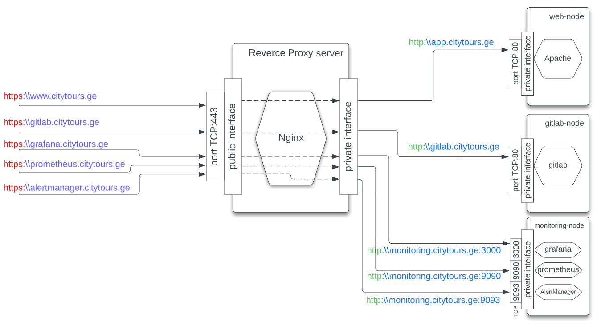

#### Роль gitlab
```shell
│   │   ├── gitlab
│   │   │   └── tasks
│   │   │       └── main.yaml
```
**К чему применяется:** Роль применяется к серверу `gitlab_node`.

**Назначение:** Скачивает и Устанавливает `gitlab`. Создаёт в `gitlab` новый проект для нашего будущего CI/CD.

#### Роль gitlabrunner
```shell
│   │   ├── gitlabrunner
│   │   │   └── tasks
│   │   │       └── main.yaml
```
**К чему применяется:** Роль применяется к серверу `gitlabrunner_node`.

**Назначение:** Скачивает и Устанавливает `Docker`. Скачивает и Устанавливает `gitlab runner`. Закачивает на сервер ssh-ключ `../../common/files/alexander-key-to-aws.pem`, с помощью которого раннер будет заливать файлы на web-сервер. Регистрирует runner в `gitlab` с типом `docker` с образом `Alpine` и проброшенной внутрь папкой с ключём.

**Особенности:** Регистрация runner - docker  была сложной проблемой. В команде на регистрацию проблемы возникали почти с каждым из параметров:

```
gitlab-runner register --non-interactive --url "http://{{ variables.gitlab_node_hostname  }}" --registration-token "{{ variables.gitlab_runner_init_token }}"
    --executor "docker"  --docker-image "alpine:latest" --description "docker-runner" --maintenance-note "this runner can makes all"
    --tag-list "docker,aws" --run-untagged="true" --locked="false" --access-level="not_protected" --docker-network-mode="host" --docker-volumes "/home/ubuntu/.ssh:/ssh"`
```
Какие возникали проблемы и как они решались см. в Приложении в конце документа.

#### Роль mysql-cluster-management
```shell
│   │   ├── mysql-cluster-management
│   │   │   ├── files
│   │   │   │   └── ndb_mgmd.service
│   │   │   ├── tasks
│   │   │   │   └── main.yaml
│   │   │   └── templates
│   │   │       └── config.ini
```
**К чему применяется:** Роль применяется к первой главной ноде будущего кластера mysql `db01_node`.

**Назначение:** Скачивает и Устанавливает `mysql-cluster-community-management-server` - cервер управления кластерами mysql. Заполняет шаблон его конфига. Устанавливает службу и включает её автозапуск.  

**Особенности:** Про устройство и работу кластеров mysql см. тут: https://dev.mysql.com/doc/refman/8.0/en/mysql-cluster-basics.html

#### Роль mysql-cluster-datanode
```shell
│   │   ├── mysql-cluster-datanode
│   │   │   ├── files
│   │   │   │   └── ndbd.service
│   │   │   ├── tasks
│   │   │   │   └── main.yaml
│   │   │   └── templates
│   │   │       └── my.cnf
```
**К чему применяется:** Роль применяется к обоим нодам будущего кластера mysql `db01_node` и `db02_node`.

**Назначение:** Скачивает и Устанавливает службу `ndb`, которая превращает сервер в Data-node для кластера mysql. Заполняет шаблон конфига. Устанавливает службу и включает её автозапуск.  

#### Роль mysql-cluster-sqlnode
```shell
│   │   ├── mysql-cluster-sqlnode
│   │   │   ├── tasks
│   │   │   │   └── main.yaml
│   │   │   └── templates
│   │   │       └── my.cnf
```
**К чему применяется:** Роль применяется к первой главной ноде будущего кластера mysql `db01_node`.

**Назначение:** Скачивает и Устанавливает кластерную версию сервера и клиента mysql, устанавливая по дороге множество зависимостей. Заполняет шаблон конфига. Устанавливает службу и включает её и прописывает в автозапуск. 
На этом установка Mysql и сборка кластера завершена.
Далее эта же роль создаёт пустую БД для `wordpress`, а также юзера, имеющего права сетевого доступа к mysql с удалённых хостов.

**Особенности:** Выполняет запросы для проверки состояния кластера и выводит результаты на экран прямо во время выполнения роли. 

В роли выполняется команда `/usr/bin/ndb_mgm -e SHOW`. Результат:
```shell
TASK [mysql-cluster-sqlnode : Print Status of Cluster] *******************************************************************************************************************************************************
ok: [db01] => {
    "msg": [
        "Connected to Management Server at: db01.citytours.ge:1186",
        "Cluster Configuration",
        "---------------------",
        "[ndbd(NDB)]\t2 node(s)",
        "id=2\t@192.168.1.4  (mysql-8.0.30 ndb-8.0.30, Nodegroup: 0, *)",
        "id=3\t@192.168.1.5  (mysql-8.0.30 ndb-8.0.30, Nodegroup: 0)",
        "",
        "[ndb_mgmd(MGM)]\t1 node(s)",
        "id=1\t@192.168.1.4  (mysql-8.0.30 ndb-8.0.30)",
        "",
        "[mysqld(API)]\t1 node(s)",
        "id=4\t@192.168.1.4  (mysql-8.0.30 ndb-8.0.30)"
    ]
}
```
А также вывод состояния нод кластера (делается SQL запросом):

`mysql -u root -p{{ variables.db_nodes_mysql_root_password }} -e 'SHOW ENGINE NDB STATUS \G'`

Результат:
```shell
TASK [mysql-cluster-sqlnode : Print Status of NDB] ***********************************************************************************************************************************************************
ok: [db01] => {
    "msg": [
        "*************************** 1. row ***************************",
        "  Type: ndbclus",
        "  Name: connection",
        "Status: cluster_node_id=4, connected_host=db01.citytours.ge, connected_port=1186, number_of_data_nodes=2, number_of_ready_data_nodes=2, connect_count=0",
        "*************************** 2. row ***************************",
        "  Type: ndbclus",
        "  Name: NdbTransaction",
        "Status: created=2, free=2, sizeof=392",
  ........
```
Как видно кластер из двух нод работает и здоров.

#### Роль monitoring
```shell
│   │   ├── monitoring
│   │   │   ├── files
│   │   │   │   ├── alert_rules.yml
│   │   │   │   ├── dashboards
│   │   │   │   │   ├── dashboard.json
│   │   │   │   │   └── dashboard.yml
│   │   │   │   └── datasources
│   │   │   │       └── datasource.yml
│   │   │   ├── tasks
│   │   │   │   └── main.yaml
│   │   │   └── templates
│   │   │       ├── alertmanager.yml.j2
│   │   │       ├── grafana.ini.j2
│   │   │       └── prometheus.yml.j2
```
**К чему применяется:** Роль применяется к серверу `monitoring_node`

**Назначение:** Устанавливает `Grafana` - система графического отображения "статистики", `Prometheus` - систему сбора данных, `AlertManager` - систему уведомления. Заполняет шаблоны их конфигов. Кроме того для `Grafana` копируются готовый подходящий шаблон отображения и файл объявления источника данных с настройкой брать данные из `Prometheus`. Для самого `Prometeus` в шаблоне конфигурации перечислены серверы, с которых нужно запрашивать у `node-exporter` данные. Кроме того мы копируем также файл с настроенными Alert-ами. Для примера отслеживаем перегрузку по CPU, памяти, и заканчивание места на диске, а также пропадание хоста со связи (недоступность node-exporter). Для `Alert Manager`  шаблон конфига заполняется данными для отправки почты из файла переменных.    

#### Роль monitoring
```shell
│   │   └── webserver
│   │       └── tasks
│   │           └── main.yaml
```
**К чему применяется:** Роль применяется к серверу `web_node`

**Назначение:** Устанавливает `Apache` - службу Web-сервера и все его зависимости. Скачивает и распаковывает систему управления сайтом `wordpress`. Настраивает путь к папке с wordpress, как путь к дефолтному сайту. Заменяет в конфиге wordpress параметры доступа к БД, на БД и юзера, которые были созданы в роли `mysql-cluster-sqlnode` по развёртыванию mysql. Перезапускает Apache.

### Работа всех систем после развёртывания

После того, как вся инфраструтура сетей и виртуальных машин была создана из `Terraform`, а затем выполнено развёртывание всего набора ПО через `Ansible` мы можем посмотреть, как работают все системы.

#### Проверка работы Web-сервера

Мы можем открыть ссылку: https://www.citytours.ge/
Нам открывается страничка донастройки `wordpress`, так как это первый запуск после инсталляции.
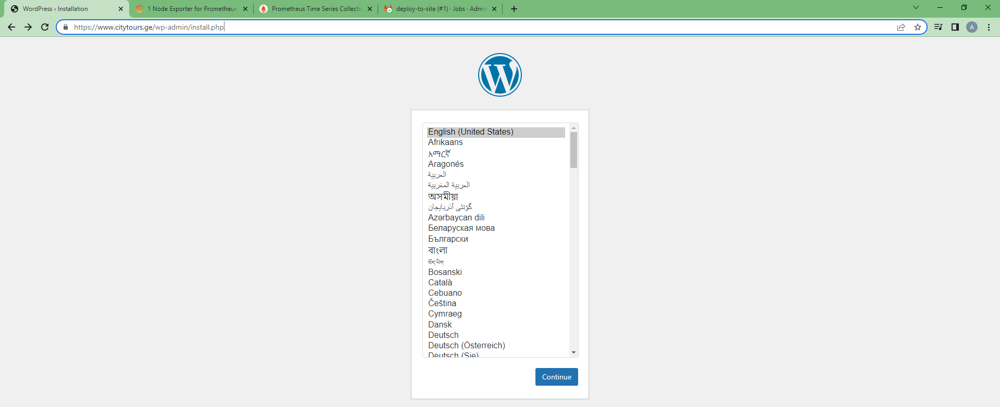
Во-первых, по этой сраничке уже можно судить, что с подключением к БД, да и с самой БД и правами на ней всё в порядке. Иначе мы бы тут увидели сообщение об ошибке связи с БД.

Во-вторых, мы можем ввести все параметры, которые тут требует `wordpress` и нам откроется дефолтный сайт.
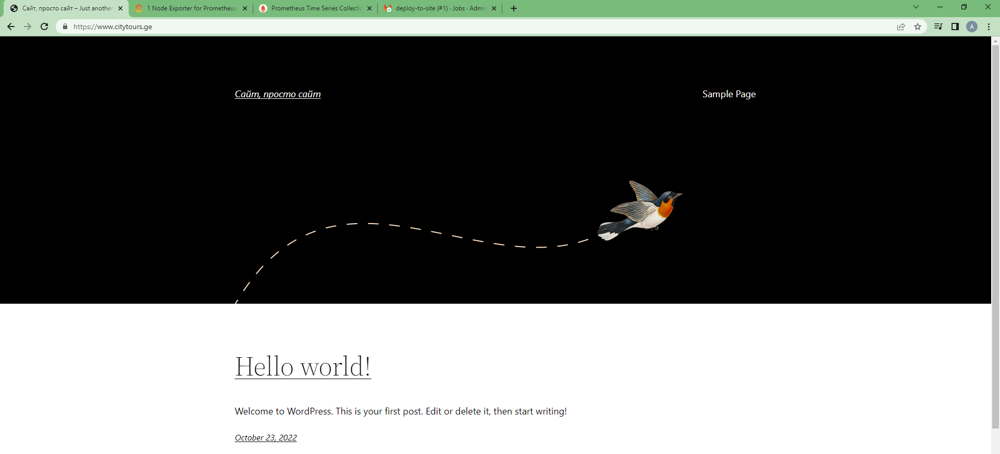

Проверим, что за сертификат у нас работает:

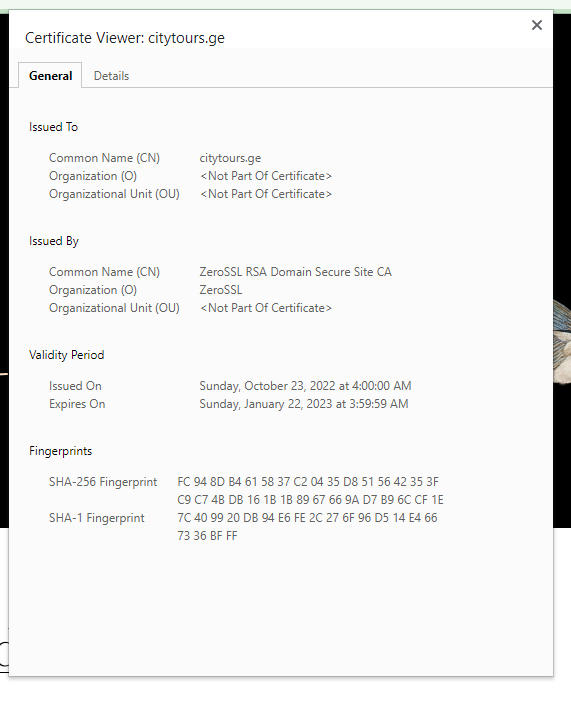

Видим, что он wildcard:

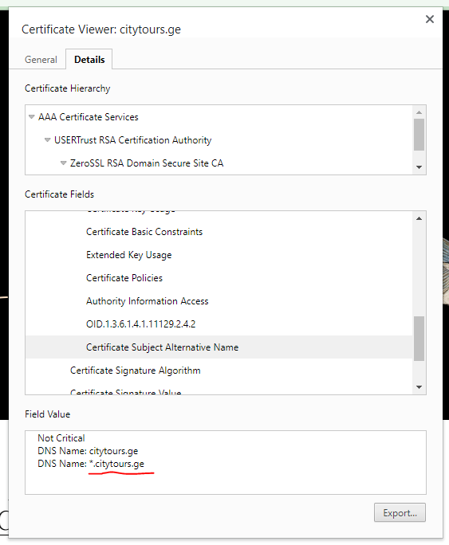

На этом пока проверку работы web-сервера можно прекратить. Всё, что пока что требовалось мы увидели.


#### Проверка работы Gitlab-сервера, Gitlab-runner

Давайте попробуем зайти в `Gitlab` по ссылке: https://gitlab.citytours.ge/

Открылась страничка входа.


Вводим логин `root` и пароль, заданный в файле переменных для `Ansible` и заходим

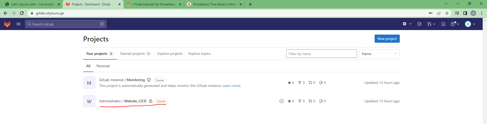

Мы видим дефолтный проект и проект с именем, указанным нами в файле переменных. Его создал `Ansible`.

Проверим состояние runner. Открываем проект, затем Settings->CI/CD->Runners. Видим наш зарегистрированный runner.

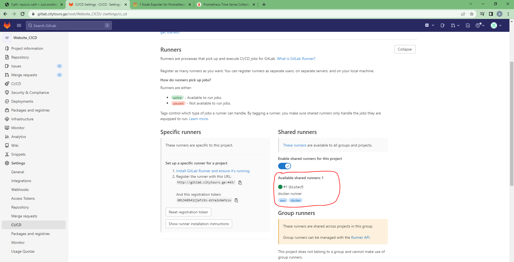

Теперь создадим в проекте папку `wordpress` для хранения файлов сайта, являющихся, как-бы нашим продуктом разработки. Внутри папки создадим файл `phpinfo.php` пусть это будет как будто файл нашего продукта.

#### Проверка работы Gitlab - CI/CD

Теперь проверим работу CI/CD. Для этого нужно создать так называемый `pipeline`. В нашем случае это будет файл ``
Вставляем в него код:
```shell
stages:
  - deploy-to-site

#variables:
#  GIT_CURL_VERBOSE: 1
#  GIT_TRACE: 1

deploy-to-site:
  stage: deploy-to-site
  before_script:
    - echo "1. Устанавливаем git" 
    - apk add git openssh

  script:
    - echo "Сейчас мы закачаем все файлы из папки wordpress репозитория на сайт" 
    - echo =====================================================================
    
    - echo "2. Клонируем репозиторий, для получения файлов для сайта" 
    - git clone $CI_REPOSITORY_URL

    - echo "3. Копируем файлы на веб-сервер" 
    - scp -i /ssh/alexander-key-to-aws.pem -o StrictHostKeyChecking=no $CI_PROJECT_TITLE/wordpress/* ubuntu@app.citytours.ge:/var/www/wordpress
```

Получается так:

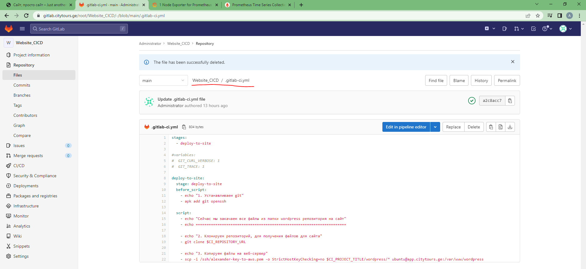

Давайте ещё раз вспомним, что представляет из себя наш раннер. На виртуальном сервере установлен "движок" `docker`. При регистрации Runner на Gitlab у нас было указано:
```shell
gitlab-runner register --non-interactive --url "http://{{ variables.gitlab_node_hostname  }}" --registration-token "{{ variables.gitlab_runner_init_token }}"
    --executor "docker"  --docker-image "alpine:latest" --description "docker-runner" --maintenance-note "this runner can makes all"
    --tag-list "docker,aws" --run-untagged="true" --locked="false" --access-level="not_protected" --docker-network-mode="host" --docker-volumes "/home/ubuntu/.ssh:/ssh"
```
Что означает, что:
* runner будет выполнять pipelin-ы присланные сервером gitlab в контейнерах `docker`
* контейнеры будут создаваться из образа `alpine` последней версии
* в контейнер будет примонтирована папка с ssh-ключём, который будет использоваться для выкладывания файлов на веб-сервер
* сеть для контейнера будет в режиме `host`

А теперь коротко пройдёмся по нашему `pipeline`:
* Выполняться он будет при любом коммите или создании тега в нашем репозитории так как никакие условия не прописаны
* в нём описан только один `stage` - `deploy-to-site`
* перед выполнением основного скрипта будет выполнен `before_script` в котором внутрь контейнера устанавливаются 2 пакета `git` и `openssh`. Первый нужен для клонирования в контейнер нашего репозитория. Второй нужен ради установки утилиты `scp`, которая будет использована для выкладывания файлов на веб-сервер.
* Основной скрипт делает всего 2 основных действия: клонирование себе в контейнер репозитория (из gitlab), ссылку на который мы берём из переменной `$CI_REPOSITORY_URL` и далее отправка всех файлов из папки `wordpress` репозитория в папку сайта на веб-сервере.

Проверим, как это работает. Для этого создадим в репозитории в папке `wordpress` ещё один файл `hello.html` с простым содержимым: `Hello World!`. И сделаем `commit`.
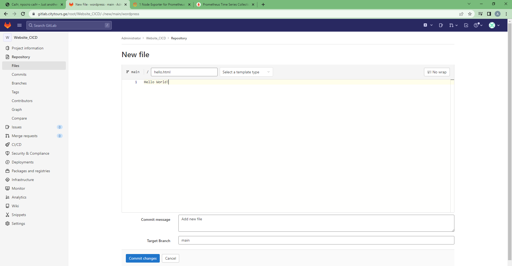

Жмём `Commit Changes`

Переходим в раздел CI/CD->pipelines

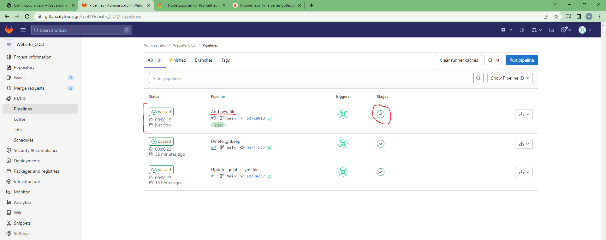

Видим, что pipeline выполнился без ошибок. Заглянем в лог его выполнения:

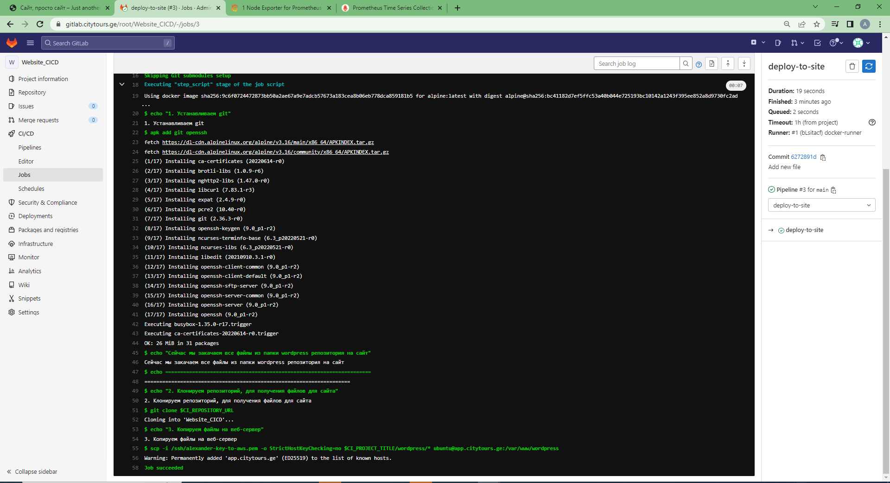

Теперь проверим есть ли на сайте все наши файлы из репозитория:
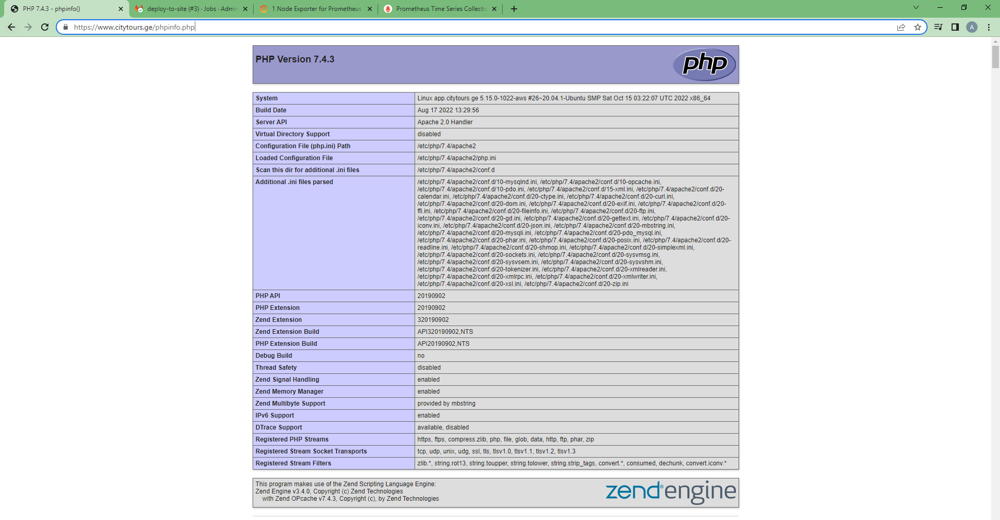

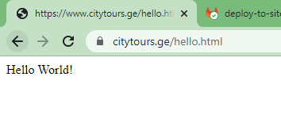

Отлично! CI/CD в нашей инфраструктуре, соданной в рамках выполнения дипломного проекта работает!

#### Проверка работы Мониторинга

Посмотрим, как работают элементы нашей системы мониторинга.

Откроем `Grafana`, а в ней (после смены дефолтного пароля (admin/admin)) открываем уже добавленный нами в процессе развёртывания, шблон.
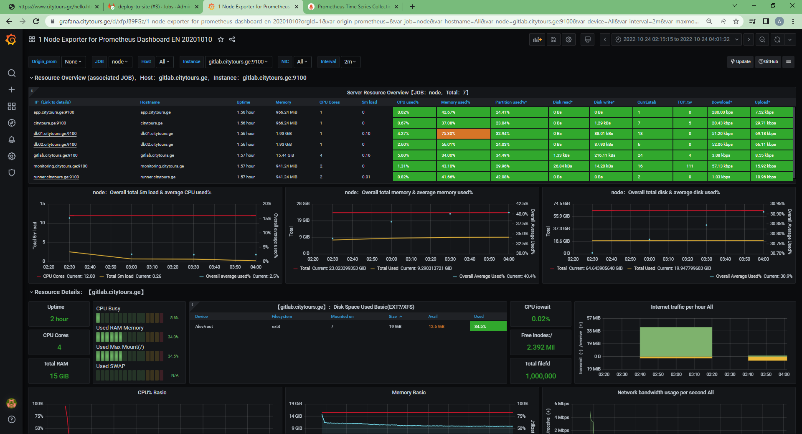

Он в верхней части показывает нам нагрузку на ресурсы всех наших серверов (см. рис выше), а в нижней половине более детальные данные по выделенному серверу:
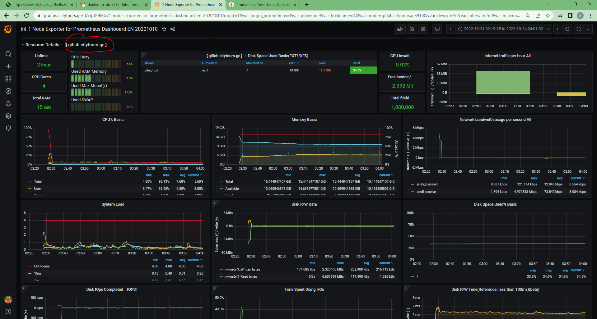

Проверим работу `Prometheus` по срабатыванию алертов. Открываем https://prometheus.citytours.ge/alerts
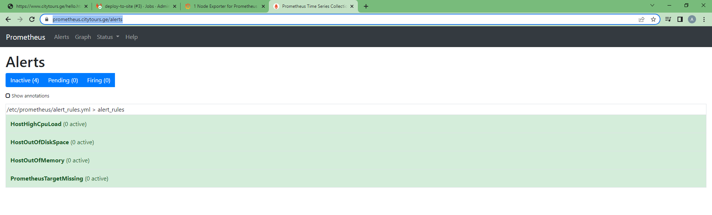

Видим, что никаких тревожных событий (в рамках тех, которые мы отслеживаем) в инфраструктуре не наблюдается. Попробуем выключить один из серверов БД.

Выключили. И через несколько секунд получаем такую картину:
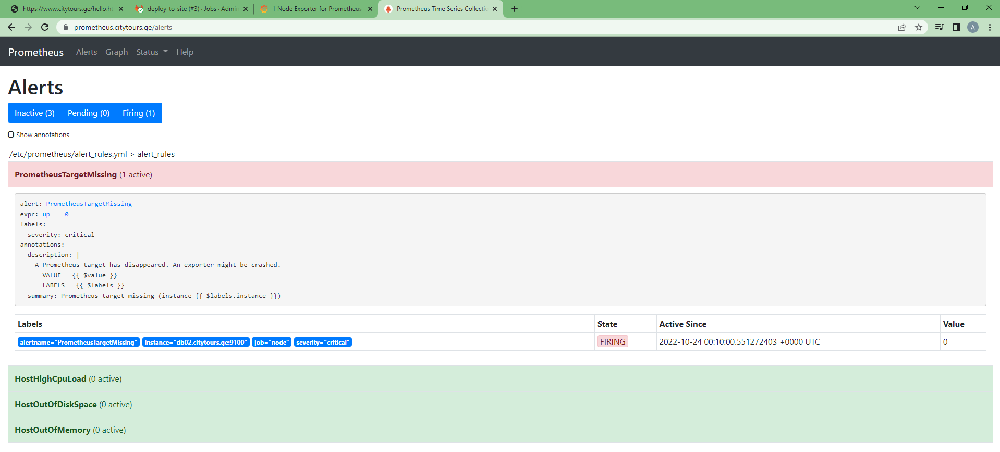

Отслеживание событий работает!

Попробуем открыть `AlertManager` : https://alertmanager.citytours.ge/metrics

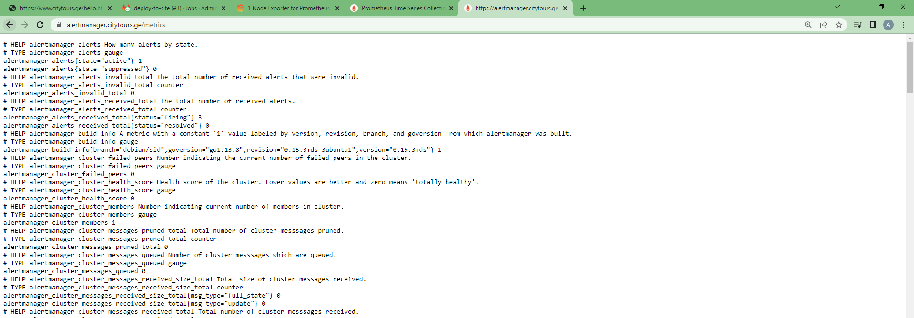

Открывается.

## Итоги
В рамках выполнения ТЗ дипломного проекта достигнуты следующие результаты:
* Разработан проект инфрасруктуры полностью реализуемый по принципам IaaC
* Создан код на `Terraform`, который разворачивает в AWS инфраструктуру состоящую из различных сетевых сущностей, требующихся для работы виртуальных сетей, а также Виртуальных Машин, выполняющих роль серверов нашего проекта. А также из Teraform происходит управление записями DNS-зоны в сервисе DNS Cloudflare, а также подготовка inventory-файла для дальнейшей работы `Ansible`. Проект разворачивается в рамках окружения (workspace) `stage`, а бекэнд настроен на хранение `states` в S3-backet в AWS.
* Создан плейбук для `Ansible`, а также набор ролей и шаблонов конфигурационных файлов для различных сервисов. Плейбук применяет соответствующие роли к нужным серверам и таким образом осуществляет развёртывание всего набора, требующегося по ТЗ софта и его настройку. 
* Полученный в результате сервер Обратного прокси принимает запросы https на все доменные имена, требующиеся в ТЗ и редиректит их во внутреннюю сеть на нужные порты нужных ВМ
* Развёрнут кластер из двух серверов mysql. В нём создана и хранится БД для сайта (ну и пользователь тоже).
* Сайт на wordpress открывается. Причём БД этого сайта размещена на кластере Mysql
* В развёрнутом Ansibl-ом сервере `Gitlab` внутри им же созданного проекта мы создали папку, хранящую файлы для нашего сайта. В этом проекте создан pipeline, который запускается при любом commit и создании тега и выполняет копирование всех файлов на сайт (веб-сервер). При этом сам pipeline запускается и работает на сервере gitlab-runner в контейнере docker. 
* Развёрнута система мониторинга, состоящая из `Grafana`, `Prometheus`, `Alert Manager`. Все эти сервисы равёрнуты и настроены Ansibl-ом на ВМ monitoring.
* В рамках всего проекта основные принципы IaaC соблюдаются.

# Приложение

## Основные проблеммы, встреченные при выполнении проекта
### Установка Mysql server переходит в интерактивный режим
При попытке из кода Ansible развернуть mysql сервер, во всяком случае вот этот пакет: `mysql-cluster-community-server_8.0.30-1ubuntu20.04_amd64.deb` инсталляция переходила в интерактивный режим и запрашивала задание пароля для root, его повтор и ещё тип авторизации. На этом месте инсталляция из Ansible останавливалась.

Решение искал долго. Перепробовал множество вариантов. В результате нашлось идеальное решение с использованием специального модуля Ansible. Но путь к этому был долгим так как сначала надо было вообще в принципе понять, как решить проблему, решить её вручную и только потом удалось найти модуль, который это может сделать. Вот, как это решается:
```shell
- name: Make answer for root password for installing mysql-community-server
  debconf:
    name: mysql-cluster-community-server
    question: mysql-cluster-community-server/root-pass
    value: "{{ variables.db_nodes_mysql_root_password }}"
    vtype: password

- name: Make answer for retype root password for installing mysql-community-server
  debconf:
    name: mysql-cluster-community-server
    question: mysql-cluster-community-server/re-root-pass
    value: "{{ variables.db_nodes_mysql_root_password }}"
    vtype: password

- name: Make answer for Authentication Methodfor installing mysql-community-server
  debconf:
    name: mysql-cluster-community-server
    question: mysql-server/default-auth-override
    value: 'Use Legacy Authentication Method (Retain MySQL 5.x Compatibility)'
    vtype: select
```

### Регистрация Gitlab Runner в Gitlab
Эта задача вообще стала очень тяжёлой проблеммой и отняла очень много времени. Никак не удавалось решить все возникающие проблемы. А их было несколько.

Это сейчас, глядя на таску по регистрации раннера кажется, что там всё понятно:
```shell
# Регистрируем gitlab-runner на сервере gitab. Он будет на основе docker внутрь контейнера монтируем папку где лежит ключ для того, чтобы раннер смог выгружать файлы на вебсервер.
# Важно, также указать режим сети докера, как host.
- name: Register gitlab runner to Gitlab server
  command: |
    gitlab-runner register --non-interactive --url "http://{{ variables.gitlab_node_hostname  }}" --registration-token "{{ variables.gitlab_runner_init_token }}"
    --executor "docker"  --docker-image "alpine:latest" --description "docker-runner" --maintenance-note "this runner can makes all"
    --tag-list "docker,aws" --run-untagged="true" --locked="false" --access-level="not_protected" --docker-network-mode="host" --docker-volumes "/home/ubuntu/.ssh:/ssh"
```

#### Runner не цеплялся к Gitlab по https
Дело в том, что сначала при установке самго Gitlab он устанавливался так, что вешался на https, при этом он даже ходил и получал свой собственный SSL сертификат. Тогда я подумал, что это даже не плохо и настроил на обратном прокси, чтоб он прокидывал запросы на https:\\gitlab... не пытаясь сменить порт или подсунуть наш общий сертификат. Всё работало пока я не начал регить раннер. Тогда начались проблемы. Были какие-то непобедимые ошибки TLS. В конце концов я понял, что надо вешать Gitlab на http. Но тоже не сразу нашёл как это сделать. При ручной установке проблем нет. А вот при развёртывании из Ansible... Решение было найдено и заключается в назначении переменных окружения перед инсталляцией gitlab:
```shell
    # Запускаем инсталляцию, предварительно задав параметры в виде переменных окружения
    # https://docs.gitlab.com/ee/administration/environment_variables.html
    - name: Install gitlab
      vars:
        env_var:
          EXTERNAL_URL: "http://{{ variables.gitlab_node_hostname }}"
          GITLAB_ROOT_PASSWORD: "{{ variables.gitlab_root_password }}"
          GITLAB_SHARED_RUNNERS_REGISTRATION_TOKEN: "{{ variables.gitlab_runner_init_token }}"
      ansible.builtin.apt:
        pkg:
          - gitlab-ee
      environment: "{{ env_var }}"
      ignore_errors: yes
```
Секрет тут: `EXTERNAL_URL: "http://`
Как видно, переменные окружения помогли решить ещё несколько проблемных задач.

#### Как получить токен для того, чтобы зарегистрировать Runner?
При установке Gitlab автоматически создаёт временный токен для регистрации раннеров и хранит его ф файле (забыл в каком), но как вытащить его оттуда и потом использовать при разворачивании другой роли для раннера, я что-то придумать не смог. Второе место где был этот токен - веб интерфейс. В разделе Settings->CI/CD->Runners в любом проекте. Там он прямо явно написан. Но оттуда его взять я тоже не придумал, как.

Решение Вам уже понятно - использование собственно-ручного заданного в файле переменных значения, которое будет передаваться в специальной переменной окружения. См. выше.

#### Контейнер Docker на раннере запускается но не может работать.
Не могу сейас вспомнить как выглядели ошибки, но смысл происходящего был в том, что при старте pipeline раннер запускал контейнер, тот запускался, но ничего не делал.

Проблема была в том, что по-умолчению контейнер запускался с непонятно каким (не помню) режимом работы сети. Решение было найдено. В команде регистрации контейнера указать режим сети: `--docker-network-mode="host"`

#### Контейнер Docker из образа Alpine не имел пакет git и не хотел его устанавливать. 
Я сначала указывал, как везде рекомендуют образ `--docker-image "alpine:latest"`, но столкнулся с тем, что в нём отсутствует git и как его доустановить я что-то не мог найти, а `apt` не срабатывала.

Я придумал использовать полноценный образ `--docker-image "ubuntu:latest"` и это сработало. Но потом выяснилось, что нет смысла тягат такой мощный образ и стартовать его постоянно. Оказывается в `Alpine` установщик `apk` и с ним всё работает.
```shell
before_script:
    - echo "1. Устанавливаем git" 
    - apk add git openssh
```

